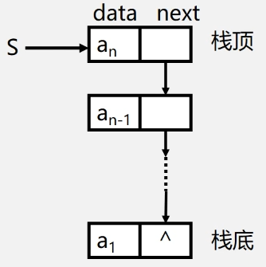
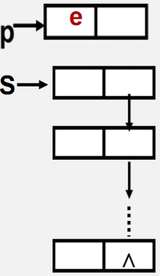
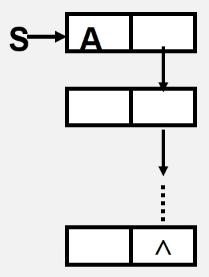
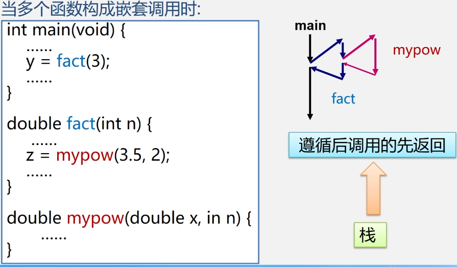
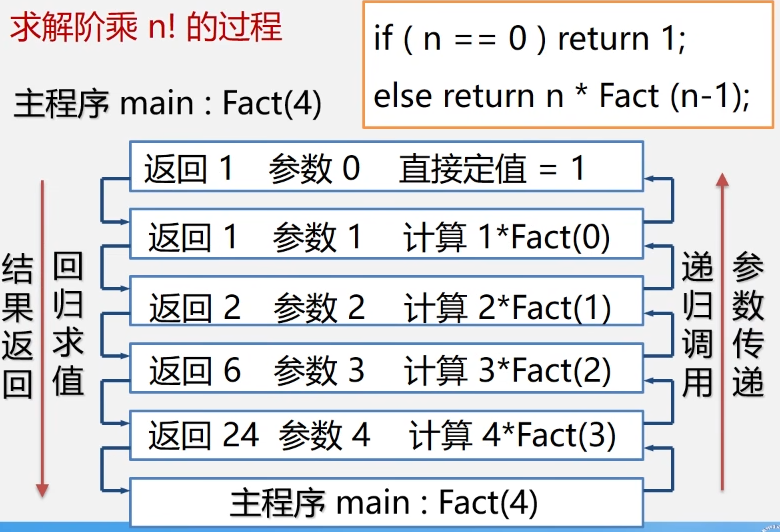

# 栈和队列

## 3.1 栈和队列的定义和特点

- 栈和队列是两种常用的、重要的数据结构

- 栈和队列是限定插入和删除只能在表的“端点”进行的**线性表**

  栈——后进先出

  队列——先进先出

### 3.1.1 栈的定义和特点

- **栈(stack)**是一个特殊的线性表，是限定仅在一端（通常是表尾）进行插入和删除操作的线性表

- 又称为**后进先出(Last In First Out)**的线性表，简称**LIFO**结构

- 栈的相关概念

  - **栈**是仅在表尾进行插入、删除操作的线性表
  - 表尾（即$a_n$端）称为**栈顶**Top; 表头(即$a_1$端)称为**栈底**Base
    
  - 插入元素到**栈顶**（即表尾）的操作，称为**入栈**
  - 从**栈顶**（即表尾）删除最后一个元素的操作，称为**出栈**

  

  1. 定义：限定只能在表的一端进行插入和删除运算的线性表（只能在栈顶操作）
  2. 逻辑结构：与线性表相同，仍为一对一关系
  3. 存储结构：用顺序栈或链式存储均可，但以顺序栈更常见
  4. 运算规则：只能在栈顶运算，且访问结点时依照后进先出（LIFO）的原则
  5. 实现方式：关键是编写入栈和出栈函数，具体实现依顺序栈或链栈的不同而不同

- 栈与一般线性表的区别：**仅在于运算规则不同**

  | 一般线性表                                                   | 栈                                                           |
  | ------------------------------------------------------------ | ------------------------------------------------------------ |
  | 逻辑结构：一对一 存储结构：顺序表、链表 运算规则：随机存取 | 逻辑结构：一对一 存储结构：顺序表、链表 运算规则：后进先出（LIFO） |

### 3.1.2 队列的定义和特点

- **队列**是一种先进先出（First In First Out —— **FIFO**）的线性表。在表的一端插入（表尾），在另一端（表头）删除
- 队列的相关概念
  1. 定义：只能在表的一端进行插入运算，在表的另一端进行删除运算的线性表（**头删尾插**）
  2. 逻辑结构：与同线性表相同，仍为**一对一**关系
  3. 存储结构：**顺序队**或**链队**，以循环顺序队列更常见
  4. 运算规则：只能在队首和队尾运算，且访问结点时依照**先进先出（FIFO）**的原则
  5. 实现方式：关键是掌握**入队**和**出队**操作，具体实现依顺序队或链队的不同而不同

## 3.2 案例引入

### 案例3.1：进制转换

- 十进制整数**`N`**向其它进制数**`d`**（二、八、十六）的转换是计算机实现计算的基本问题

  **转换法则：除以`d`倒取余**

  该转换法则对应于一个简单算法原理：

  `n = (n div d) * d + n mod d`

  其中：`div`为整除运算，`mod`为求余运算
  

### 案例3.2：括号匹配的检验

- 假设表达式中允许包含两种括号：圆括号和方括号

- 其嵌套的顺序随意，即：

  1. `( [ ] ( ) ) `或 `[ ( [ ] [ ] ) ] `为正确格式
  2. `[ ( ] )` 为错误格式
  3. `( [ ( ) )` 或 `( ( ] ) `为错误格式

  

### 案例3.3：表达式求值

- 表达式求值是程序设计语言编译中一个最基本的问题，它的实现也需要运用栈
- 这里介绍的算法是由运算符优先级确定运算顺序的对表达式求值算法——**算符优先算法**
- 表达式的组成
  - **操作数(operand)**：常数、变量
  - **运算符(operator)**：算数运算符、关系运算符和逻辑运算符
  - **界限符(delimiter)**：左右括弧和表达式结束符
- 任何一个算数表达式都由**操作数**（常数、变量）、**算数运算符**（`+、-、*、/`）和**界限符**（括号、表达式结束符‘`#’`、虚设的表达式起始符‘`#`’组成。后两者统称为算符）
  - 例如： `# 3 * ( 7 - 2 ) #`

为了实现表达式求值，需要设置两个栈：
	一个是算符栈`OPTR`，用于寄存运算符
	另一个称为操作数栈`OPND`，用于寄存运算数和运算结果
求值的处理过程是自左至右扫描表达式的每一个字符
	当扫描到的是运算数，则将其压入栈`OPND`
	当扫描到的是运算符时
		若这个运算符比`OPTR`栈顶运算符的优先级高，则入栈`OPTR`，继续向后处理
		若这个运算符比`OPTR`栈顶运算符优先级低，则`OPND`栈中弹出两个运算数，从栈`OPTR中`弹出栈顶运算符进行运算，并将运算结果压入栈`OPND`
	继续处理当前字符，知道遇到结束符为止

### 案例3.4：舞伴问题

- 假设在舞会上，男士和女士各自排成一队。舞会开始时依次从男队和女队的队头各出一人配成舞伴。如果两队初始人数不相同，则较长的那一队中未配对者等待下一轮舞曲。现要求写一算法模拟上述舞伴配对问题。
- 显然，先入队的男士或女士先出队配成舞伴。因此该问题具有典型的先进先出特性，可以用队列作为算法的数据结构。
  - 首先构造两个队列
  - 依次将队头元素出队配成舞伴
  - 某队为空，则另外一队等待着则是下一舞曲第一个可获得舞伴的人

## 3.3 栈的表示和操作的实现

### 3.3.1 栈的抽象数据类型的类型定义

~~~ cmd
ADT Stack {
	数据对象:
		D ={ ai | ai∈ElemSet, i=1,2..n,n≥0 }
    数据关系:
		R1={ <ai-1,ai> | ai-1,ai∈D, i=2..n }
		约定 an 端为栈顶，a1 端为栈底。
	基本操作: 初始化、进栈、出栈、取栈顶元素等
} ADT Stack
~~~

#### `InitStack(&S)`初始化操作

操作结构：构造一个空栈`S`

#### `DestoryStack(&S)` 销毁栈操作

初始条件：栈`S`已存在
操作结果：栈`S`被销毁

#### `StackEmpty(S)` 判定`S`是否为空栈

初始条件：栈`S`已存在
操作结果：若栈为空栈，则返回`TRUE`，否则`FALSE`

#### `StackLength(S)`求栈的长度

操作结果：栈`S`已存在
操作结果：返回`S`的元素个数，即栈的长度

#### `GetTop(S, &e)` 取栈顶元素

初始条件：栈`S`已存在且非空
操作结果：用`e`返回`S`的栈顶元素

#### `ClearStack(&S)` 栈置空操作

初始条件：栈`S`已存在
操作结果：将`S`清为空栈

#### `Push(&S, e)` 入栈操作

初始条件：栈`S`已存在
操作结果：插入元素`e`为新的栈顶元素

#### `Pop(&S, &e)` 出栈操作

初始条件：栈`S`已存在且非空
操作结果：删除`S`的栈顶元素$a_n$，并用`e`返回其值

### 3.3.2 顺序栈的表示和实现

存储方式：同一般线性表的顺序存储结构完全相同，利用一组地址连续的存储单元一次存放自栈底到栈顶的数据元素。栈底一般在低地址段

- 附设**`top`**指针，指示栈顶元素在顺序栈中的位置
  但是，为了操作方便，通常`top`指示真正的**栈顶元素之上**的下标地址
- 另设**`base`**指针，指示栈底元素在顺序栈中的位置
- 另外，用**`stacksize`**表示栈可使用的最大容量

例：**`stacksize = 4`**

- 空栈：**`base == top`**是栈空标志
- 栈满：**`top - base == stacksize`**
- 栈满时的处理方法
  1. **报错**，返回操作系统
  2. **分配更大的空间**，作为栈的存储空间，将原栈的内容移入新栈

使用数组作为顺序栈存储方式的特点：简单、方便、但易产生溢出（数组大小固定）

- **上溢(overflow)**：栈已经满，又要压入元素
- **下溢(underflow)**：栈已经空，还要弹出元素

注：上溢是一种错误，使问题的处理无法进行；而下溢一般认为是一种结束条件，即问题处理结束

#### 顺序栈的表示

~~~ cpp
#define MAXSIZE 100
typedef struct {
    SElemType *base;    // 栈底指针
    SElemType *top;     // 栈顶指针
    int stacksize;      // 栈可用最大容量
}SqStack;
~~~

#### 【算法3.1】顺序栈的初始化

~~~ c++
Status InitStack(SqStack &S) {
    S.base = new SElemType[MAXSIZE];    // S.base = (SElemType *)malloc(MAXSIZE * sizeof(SElemType));
    if (!S.base) exit(OVERFLOW);        // 存储分配失败
    S.top = S.base;                     // 栈顶指针等于栈底指针
    S.stacksize = MAXSIZE;
    return OK;
}
~~~

#### 【算法补充】顺序栈判断栈是否为空

~~~ c++
Status StackEmpty(SqStack S) {
    if (S.top == S.base) { return TRUE; }
    return FALSE;
}
~~~

#### 【算法补充】求顺序栈的长度

~~~ c++
int StackLength(SqStack S) {
    return S.top - S.base;
}
~~~

#### 【算法补充】清空顺序栈

~~~ c++
Status ClearStack(SqStack &S) {
    if (S.base) S.top = S.base;
    return OK;
}
~~~

#### 【算法补充】销毁顺序栈

~~~ c++
Status DestoryStack(SqStack &S) {
    if (S.base) {
        delete[] S.base;
        S.base = S.top = NULL;
        S.stacksize = 0;
    }
    return OK;
}
~~~

#### 【算法3.2】顺序栈的入栈

~~~ c++
Status Push(SqStack &S, SElemType e) {
    if (S.top - S.base >= S.stacksize) { return ERROR; }
    *S.top++ = e;
    return OK;
}
~~~

#### 【算法3.3】顺序栈的出栈

~~~ c++
 Status Pop(SqStack &S, SElemType &e) {
    if (S.top == S.base) { return ERROR; }
    e = *--S.top;
    return OK;
}
~~~

### 3.3.3 链栈的表示和实现

#### 链栈的表示

- 链栈是运算受限的单链表，只能在链表头部进行操作

  ~~~ c++
  typedef struct StackNode {
      SElemType data;
      struct StackNode *next;
  }StackNode, *LinkStack;
  LinkStack S;
  ~~~

  

  注意：链栈中指针的方向

  - 链表的头指针就是栈顶
  - 不需要头结点
  - 基本不存在栈满的情况
  - 空栈相当于头指针指向空
  - 插入和删除仅在栈顶处执行

#### 【算法3.5】链栈的初始化

~~~ c++
void InitStack(LinkStack &S) {
    //构造一个空栈，栈顶指针置为空
    S=NULL;
    return OK;
}
~~~

#### 【补充算法】判断链栈是否为空

~~~ c++
Status StackEmpty(LinkStack S) {
    if (S == NULL) return TRUE;
    else return FALSE;
}
~~~

#### 【算法3.6】链栈的入栈

~~~ c++
Status Push(LinkStack &S, SElemType e) {
    p=new StackNode;    //生成新结点p
    p->data=e;          //将新结点数据域置为e
    p->next=S;          //将新结点插入栈顶
    S=p;                //修改栈顶指针
    return OK;
}
~~~

#### 【算法3.7】链栈的出栈

~~~ c++
Status Pop (LinkStack &S, SElemType &e) {
    if (S==NULL) return ERROR;
    e = s->data;
    p = s;
    S = s->next;
    delete p;
    return OK;
}
~~~

#### 【算法3.8】取栈顶元素

~~~ c++
SElemtype GetTop(LinkStack S) {
    if (S != NULL) {
        return S->data;
    }
}
~~~

## 3.4 栈和递归

- **递归的定义**

  - 若一个对象部分地**包含它自己**，或用它**自己给自己定义**，则称这个对象是递归的

  - 若一个过程**直接地或间接地调用自己**，则称这个过程是递归的过程

    - 例如：递归求n的阶乘
      ~~~ c++
      long Fact(long n) {
          if (n == 0) return 1;
          else return n * Fact(n - 1);
      }
      ~~~

- **以下三种情况尝尝用到递归方法**

  - 递归定义的数学函数
  - 具有递归特性的数据结构
  - 可递归求解的问题

- **递归问题——用分治法求解**

  - **分治法**：对于一个较为复杂的问题，能够分解成几个相对简单的且解法相同或类似的子问题来求解

    **必备的三个条件**：

    1. 能将一个问题转变为一个新问题，而新问题与原问题的解法相同或类同，不同的仅是处理的对象，且这些处理对象是变化有规律的
    2. 可以通过上述转化而使问题简化
    3. 必须有一个明确的递归出口，或称递归边界

    **分治法求解递归问题算法的一般形式**

    ~~~ c++
    void p(参数表) {
        if (递归结束条件) 可直接求解步骤； --基本项
        else p (较小的参数); --归纳项
    }
    ~~~

- **函数调用过程**

  调用前系统完成：

  1. 将**实参，返回地址**等传递给被调用函数
  2. 为被调用函数的**局部变量**分配存储区
  3. 将控制转移到被调用函数的**入口**

  调用后，系统完成

  1. 保存被调用函数的计算**结果**
  2. 释放被调用函数的**数据区**
  3. 依照被调用函数保存的**返回地址**将控制转移到调用函数
  
  

- **递归函数调用的实现**

  “层次”	主函数		0层
  		  第一次调用	1层
  		  ......
  		  第i次调用	   i层
  “递归工作栈”——递归程序运行期间使用的数据存储区
  “工作记录”——实在参数，局部变量，返回地址

- **递归的优缺点**

  优点：结构清晰，程序易读

  缺点：每次调用都要生成工作记录，保存状态信息，入栈；返回时要出栈，恢复状态信息，时间开销大。

  **递归->非递归**

  方法1：尾递归、单向递归->**循环结构**

  方法2：自用**栈**模拟系统的运行时栈

- **借助栈改写递归**

  - 递归程序在执行时需要系统提供栈来实现
  - 仿照递归算法执行过程中递归工作栈的状态变化可写出相应的非递归程序
  - 改写后的非递归算法与原来的递归算法相比，结构不够清晰，可读性较差，有的还需要经过一系列优化

## 3.5 队列的表示和操作的实现

队列的抽象数据类型定义

### 3.5.2 队列的顺序表示和实现

- 队列的物理存储结构可以用顺序存储结构，也可用链式存储结构，相应的，队列的存储方式也分为两种，即**顺序队列**和**链式队列**

- 队列的顺序表示——用一位数组**`base[MAXQSIZE]`**

  ~~~ c++
  typedef struct {
      QElemType *base; // 初始化的动态分配储存空间
      int front;       // 队头指针
      int rear;        // 队尾指针
  }SqQueue;
  ~~~

设数组大小为`MAXQSIZE`

- `rear = MAXQSIZE`时，发生**溢出**
- 若`front = 0， rear = MAXQSIZE`时再入队——**真溢出**
- `front != 0, rear = MAXQSIZE`时再入队——**假溢出**

解决假上溢的方法

1. 将队中元素依次向队头方向移动
   缺点：浪费时间，每移动一次，队中元素都要移动
2. 将队空间设想成一个循环的表，即分配给队列的`m`个存储单元可以循环使用，当`rear`为`maxqsize`时，若向量的开始端空着，又可以从头使用空着的空间。当`front`为`maxqsize`时，也是一样

**引入循环队列**

`base[0]`接在`base[MAXQSIZE-1]`之后，若`rear+1==M`，则令`rear=0;`

实现方法：利用**模(mod，C语言中%)运算**
插入元素：`Q.base[Q.rear]=x;`
		  `Q.rear=(Q.rear+1)%MAXQSIZE;`
删除元素：`x=Q.base[s.front]`
		  `Q.front=(Q.front+1)%MAXQSIZE`
循环队列：循环使用为队列分配的存储空间

循环队列队空队满判断

#### 【算法3.11】循环队列的操作——队列的初始化

~~~ c++
Status InitQueue(SqQueue &Q) {
    Q.base = new QElemType[MAXQSIZE]; //分配数组空间
    if(!Q.base) {exit(OVERFLOW);}     //分配失败
    Q.front = Q.rear = 0;             //初始化队头、队尾指针
    return OK;
}
~~~

#### 【算法3.12】循环队列的操作——求队列的长度

~~~ c++
int QueueLength(SqQueue Q) {
    return ((Q.rear - Q.front + MAXQSIZE) % MAXQSIZE); 
}
~~~

#### 【算法3.13】循环队列的操作——循环队列入队

~~~ c++
Status EnQueue(SqQueue &Q, QElemType e) {
    if ((Q.rear + 1) % MAXQSIZE == Q.front) { return ERROR; } //队满
    Q.base[Q.rear] = e;                                       //新元素加入队尾
    Q.rear = (Q.rear + 1) % MAXQSIZE;                         //队尾指针+1
    return OK;
}
~~~

#### 【算法3.14】循环队列的操作——循环队列出队

~~~ c++
Status DeQueue(SqQueue &Q, QElemType &e) {
    if (Q.front == Q.rear) { return ERROR; } //队空
    e = Q.base[Q.front];                     //保存队头元素
    Q.front = (Q.front + 1) % MAXQSIZE;      //队头指针+1
    return OK;
}
~~~

####  【算法3.15】循环队列的操作——取队头元素

~~~ c++
QElemType GetHead(SqQueue Q) {
    if (Q.front != Q.rear) { return Q.base[Q.front]; }
}
~~~

### 3.5.3 链队——队列的连时表示和实现

若用户无法估计所用的队列的长度，则宜采用链队列

链队列的类型定义

~~~ c++
typedef struct Qnode {
    QElemType data;
    struct Qnode *next;
}QNode, *QueuePtr;

typedef struct {
    QueuePtr front;
    QueuePtr rear;
}LinkQueue;
~~~

链队列运算指针变化情况

#### 【算法3.16】链队列的操作——链队列的初始化

~~~ c++
Status InitQueue(LinkQueue &Q) {
    Q.front = Q.rear = new QNode;
    if (!Q.front) { exit(OVERFLOW); }
    Q.front->next = NULL;
    return OK;
}
~~~

#### 【补充算法】链队列的操作——销毁链队列

算法思想：从队头结点开始，依次释放所有结点

~~~ c++
Status DestoryQueue(LinkQueue &Q) {
    while(Q.front) {
        QueuePtr p = Q.front->next; 
        free(Q.front);
        Q.front = p;
    }
    return OK;
}
~~~

#### 【算法3.17】链队列的操作——将元素e入队

~~~ c++
Status EnQueue(LinkQueue &Q, QElemType e) {
    QueuePtr p = new QNode;
    if(!p) {exit(OVERFLOW);}
    p->data = e;
    p->next = NULL;
    Q.rear->next = p;
    Q.rear = p;
    return OK;
}
~~~

#### 【算法3.18】链队列的操作——链队列出队

~~~ c++
Status DeQueue(LinkQueue &Q, QElemType &e) {
    if (Q.front == Q.rear) { return ERROR; }
    QueuePtr p = Q.front->next;
    e = p->data;
    Q.front->next = p->next;
    if (Q.rear == p) { Q.rear = Q.front; }
    delete(p);
    return OK;
}
~~~

#### 【算法3.19】链队列的操作——求链队列的队头元素

~~~ c++
Status GetHead(LinkQueue Q, QElemType &e) {
    if (Q.front == Q.rear) { return ERROR; }
    e = Q.front->next->data;
    return OK;
}
~~~
